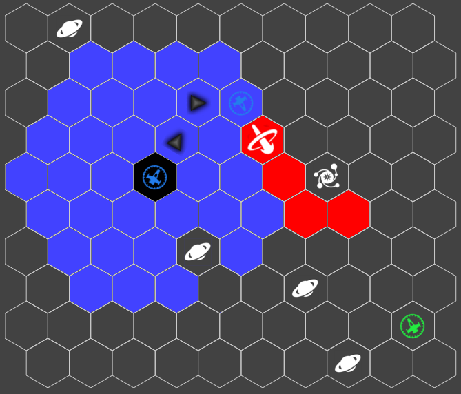

# FutureSpace

FutureSpace is a simultaneous strategy game based on the space ship.

## What is a simultaneous strategy game?

We will start by talking about two concepts separately (simultaneous game and strategy game).

Simultaneous type of game is a game of guessing. A classic example of this type of game is Rock, Paper, Scissor. When the player is playing Rock, Paper, Scissor with anyone, they usually don't know what action the opponent picks ahead of time. In other word, they have to guess what opponent is going to pick and counter their selection accordingly. Lets say opponent tends to pick rock for his/her action, player might be leaning toward picking paper even though there is no guarantee that the opponent will pick rock. This decision is based on the tendency rather than the board information.

On the opposite of the simultaneous game is the strategy game. Players have to utilize the information they get from the game (such as board position) and make decision based on the information they have. An example of the strategy game is Chess. Chess involves a lot of computation to think ahead of time since you have all the information on the board. One can simply uses the information to predict outcome of an action.

On the same topic of the strategy game, we also have real-time strategy game like Starcraft. In Starcraft, players have to make decision very quickly compared to Chess which players have more time to think in between each move. This leads to high learning curve for the game. High learning curve means the players, mostly, will not enjoy the game until they learn certain aspect of the game (like micro/macro, having high action per second and so on).

This is where *simultaneous strategy game* comes in. What I want to accomplish in the simultaneous strategy game is to combine the fun of both simultaneous game (guessing) and strategy game (decision making based on the information).

In simultaneous strategy game, player will be able to see the board information and there will be some actions that leads to higher reward. So, the player can use these actions (with good outcome) to eliminate some guessing of other player or force other player to react to his/her action. In this matter, the luck element in the simultaneous game would be kind of eliminated (or at least not heavily depending on the luck to win the game) because of the strategy element.

Starting here, I will talk about the simultaneous elements and strategy elements separately and then after the elements, I will go through the concrete story (context) and what objects we have.

## Simultaneous elements

### Actions

In FutureSpace, players have to make actions in the same time and the game engine will resolve the actions (from all players) together with some *resolution rules*.

Players will make their actions in limited time fashion (lets say 10 seconds). Within 10 seconds, players have to decide where to go, what to attack or any other actions we added in the game later. As for the design now, I'm thinking actions limiting into only move and attack and player can only do two actions in the same turn (unless their spaceship has other talents changing the rule).

Player can decide to do the two actions in the following fashion:

* Move and attack
* Attack and move
* Move twice

Following screenshot shows the action of move and attack:

The blue area are the range of where player can move to and red is the range of attack. In this example, I added up some other elements in the game (such as the blackhole to change the attack range).

One thing to note here is player has no idea where the opponent will move to or attack. Therefore, it's important for this player to guess what opponent does.

Once players make his/her actions. Server/game engine will wait for everyone else to finish submitting their actions until the resolution phase.

---

### Resolution of actions

When server/game engine gets all actions, it will resolve the action followed the resolution laws we define.

What kind of resolutions we are expecting?

* Move into the same space
* Attack into the same space
* Attack to spaceship

#### Move into the same space

This is the first collision law we will need to resolve. Lets say both spaceships move into the same space at the same time, game engine/server will need to determine who move into the space or what not. We can resolve this collision in few ways:

1. Both player has the same type of spaceship, then no one move into the space (they bump into each other and take damage) and actions are both stopped as their ship takes damage
2. One player has heavy spaceship and other has light spaceship, heavy spaceship gets to move into the space and continue movement if there is any. Light spaceship get knocked away and lose its action for this turn.

This assumes we will have different types of spaceship (which I think we should have).

#### Attack into the same space

This means their laser attack or missile collide into either as they are moving into their direction of attacking. Similar to the move into the same space section above, we will resolve the actions based on the attack type. Lets give some examples.

* Laser attack into missiles, missiles explored and laser continue attacking.
* Melee attack into missiles, missiles hits melee units

#### Attack to spaceship

This part is the simplest action to resolve, spaceship simply takes the damage based on the direction unless they have shield set up in that direction.

---

From here, you might have a question -- wait, what are the spaceship types, attack types, and there are shields too!? How many variations do we have?

This goes to the strategy part of the game. Lets continue from the strategy part of the game.

## Strategy elements

This part is where players need to make decision based on the information they know. Decisions involve spaceship upgrades, conquering planets, build a new spaceship, or any other actions we add in the future.

### Spaceship upgrades

Players start the spaceship with minimal equipment as the start. As they gain more resources in the game by conquering planets, they will get static income over turns. They can spend resources on upgrading their spaceship or building a new spaceship.

Upgrading spaceship includes:

* Buy a weapon/ammo
* Repair spaceship
* Recharge energy
* Change the spaceship type
	* To light but fast
	* To heavy but steady (with higher capacity on weapon & energy)
	* Maybe we can add special types like stealth ability later

### Building a new spaceship

Building a new spaceship is simply building a new spaceship from the factory (some planets may have it and others may not). Building a new spaceship is a long term investment that takes a few turn to build a new spaceship but once it's built, you control more than one spaceship at the game!

### Conquering planets

Conquering planets is the map objectives so to speak. Players need to make decision by conquering the planets and get income from the planet in order to do the upgrades above.

Conquering planets is as simple as moving onto the planet and stay there until the end of turn to conquer it. Once a planet is conquered, they will generate passive income for the owner.

There are a few different resources that planet can generate. All will negate gold regardless, some may have factory so that player can upgrade their spaceship. Some may have other resources we can add in future (like gas or whatever).

## Simultaneous strategy game in combine

By combining the strategy elements (macro) and simultaneous elements (micro), player need to make various decisions based on the opponent they are facing.

If you are still confused on what the game is all about please feel free to send me a message!